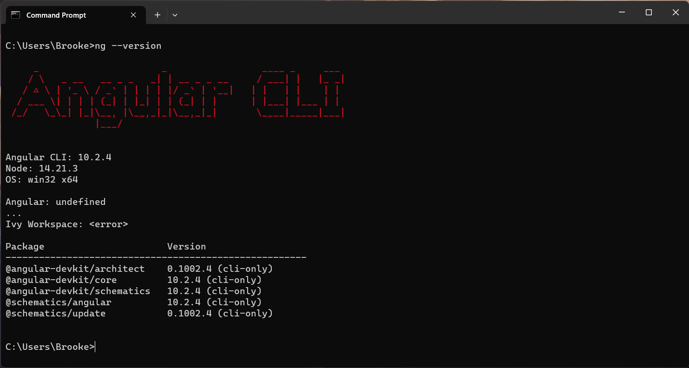
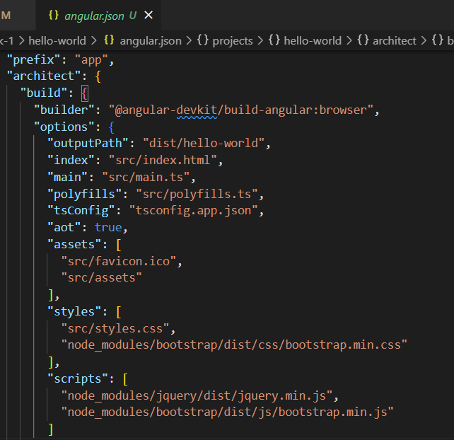
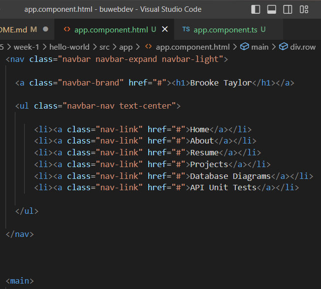
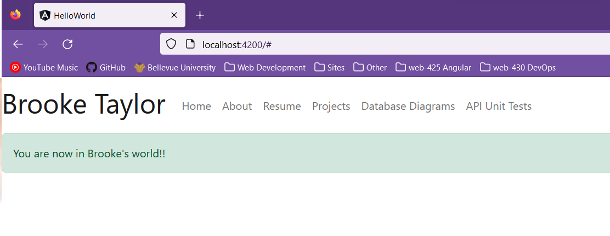

# WEB425 - Angular with TypeScript

To use Angular 10, you will need Node 14. 

        nvm install 14

        nvm use 14

        npm install -g @angular/cli@10

---

## Exercise 1.3 - Angular CLI 

This exercise is intended to demonstrate how to install Angular's CLI and create your first, 

* Generate a new Angular application 

        ng new hello-world

* Add Bootstrap and jQuery:

        ng install --save bootstrap jquery popper.js

* Audit the application for potential npm errors and fix them 

        npm audit
        npm audit fix

* Wire Bootstrap and jQuery in the angular.json file: 

* Rename the title variable in the `app.component.ts` file to "myWorld" and assign it the value "You are now in Brooke's world!!"

        export class AppComponent {
                myWorld = "You are now in Brooke's world!!";
        }

* Add a top navigation bar to the `app.component.html` file with a "main" HTML container

* Inside the "main" container, add a single row spanning 12 columns and output the myWorld message inside of an "alert" div using the CSS class "alert-success"

---

