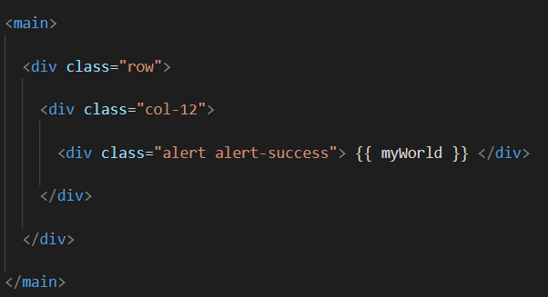

# WEB425 - Angular with TypeScript

To use Angular 10, you will need Node 14. 

        nvm install 14

        nvm use 14

        npm install -g @angular/cli@10

---

## Exercise 1.3 - Angular CLI 

This exercise is intended to demonstrate how to install Angular's CLI and create your first, 

* Generate a new Angular application 

        ng new hello-world

* Add Bootstrap and jQuery:

        ng install --save bootstrap jquery popper.js

* Audit the application for potential npm errors and fix them 

        npm audit
        npm audit fix

* Wire Bootstrap and jQuery in the angular.json file: 

* Rename the title variable in the `app.component.ts` file to "myWorld" and assign it the value "You are now in Brooke's world!!"

        export class AppComponent {
                myWorld = "You are now in Brooke's world!!";
        }

* Add a top navigation bar to the `app.component.html` file with a "main" HTML container

* Inside the "main" container, add a single row spanning 12 columns and output the myWorld message inside of an "alert" div using the CSS class "alert-success"

---

## Exercise 1.4 - TypeScript

* Create a new directory and name it `ts-examples`

                mkdir ts-examples

* Create a new npm package.json file: 

                npm init

* Setup the directory for TypeScript - 
* Install TypeScript, tslint, & @node/types

                npm install -D typescript tslint @types/node

* Generate a new tsconfig.json file: 
                
                npx tsc --init

* tsconfig.json

* native JavaScript code will be transpiled into dist dir.

* lib: ["ES2015"]

![lib: ["ES2015"]](images/lib.png)

* moduleResolution: "node"

* Generate a tslint.json file: 

        node_modules/.bin/tslint --init

### continued.

First thing, go into `package.json` file to add a script, allows us to transpile our TypeScript code into JavaScript code.

        "scripts": {
                "person-class": "tsc && node dist/person.class.js",
                "test": "echo \"Error: no test specified\" && exit 1"
        },

> new script command, so when you run `npm run person-class`, it's going to run this command in quotes. Steps are `tsc` - typescript transpiler, then going to run node under the `dist/person.class.js` file.

